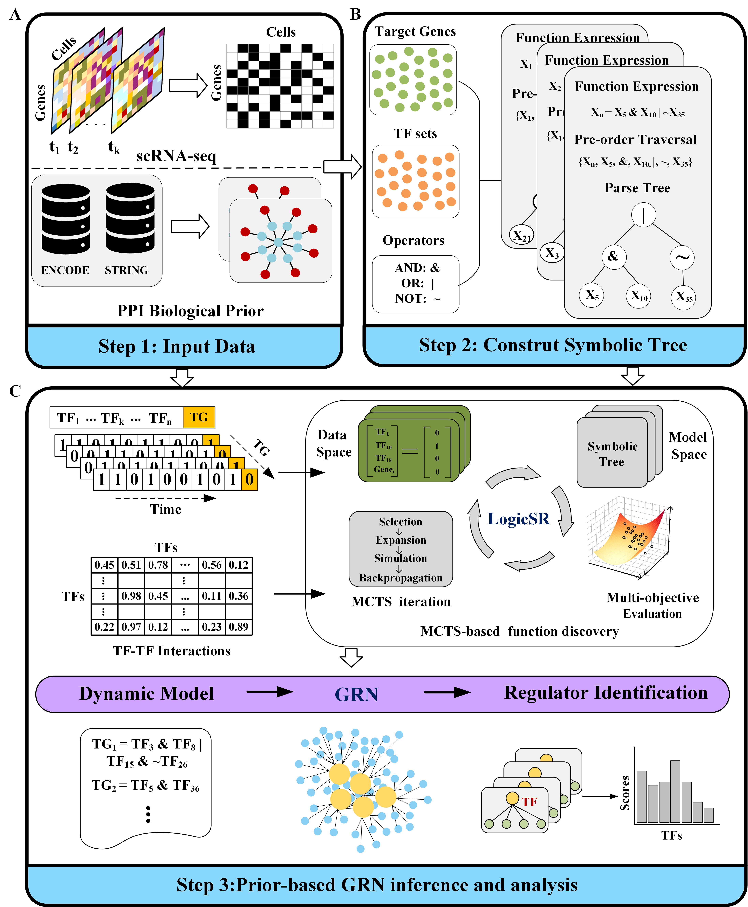

# [Prior-guided Monte Carlo tree search for symbolic inference of gene regulatory network from single-cell transcriptomics data](https://github.com/NETTRRE/GRN-infer.git)

  In this work, we introduce LogicSR, a computational framework that reconstructs gene regulatory networks from single-cell gene expression data with high accuracy by integrating the mechanistic interpretability of logical models with the equation-discovery capabilities of symbolic regression. It incorporates prior knowledge into a multi-objective Monte Carlo tree search framework, leveraging it to ensure biological plausibility and accelerate the search for optimal governing equations.

## Dependencies
requirements.txt
  
## Usage

1. Install

   pip install -r requirements.txt 
   Requires Python ≥ 3.8 (3.9–3.11 recommended)
  
2. Prepare inputs
   
   Expression matrix: CSV/TSV with rows = cells and columns = genes. Values are binarized internally
   PPI matrix: Protein × Protein weight matrix
   TF list: lists of transcription factors (TFs) for the following species: Human; Mouse.
4. Run & outputs
 
   python -m logsr.run \
   --expr expr.csv --ppi ppi.csv --tfs tf_list.txt \
   --out_edges grn_edges.tsv \
   --iter 800 --cuct 1.4 --w1 0.30 --w2 0.50 --gamma 1e-3 --eta 0.95 --seed 7

